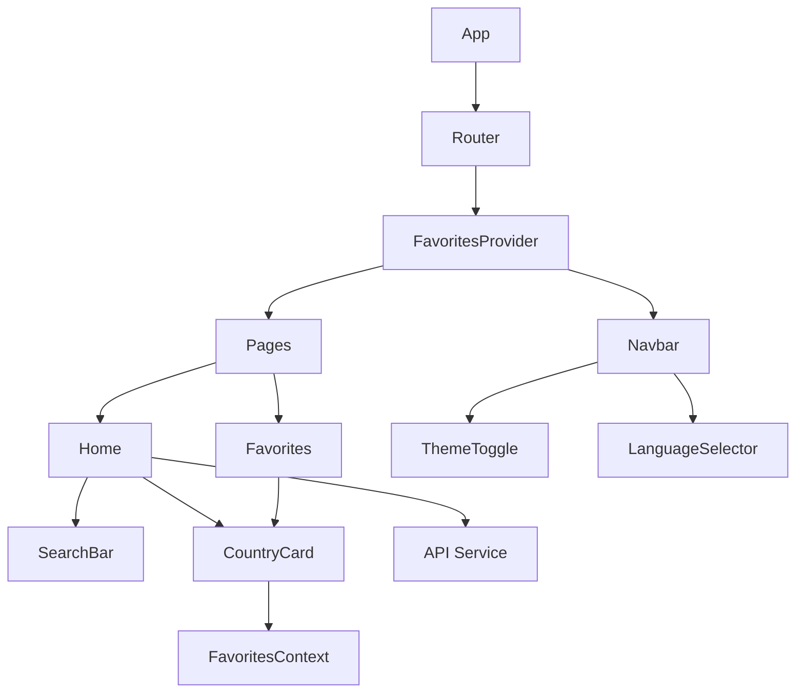

[🇺🇸](README.md)

# 🌎 Search Country App

Uma aplicação web moderna e responsiva para explorar informações sobre países, com suporte a múltiplos idiomas e temas.

## 📋 Índice

- [Visão Geral](#-visão-geral)
- [Funcionalidades](#-funcionalidades)
- [Tecnologias](#-tecnologias)
- [Arquitetura](#-arquitetura)
- [Instalação](#-instalação)
- [Estrutura do Projeto](#-estrutura-do-projeto)
- [Componentes](#-componentes)
- [Contextos](#-contextos)
- [Serviços](#-serviços)
- [Internacionalização](#-internacionalização)
- [Temas](#-temas)
- [Performance](#-performance)
- [Contribuição](#-contribuição)
- [Licença](#-licença)

## 🔭 Visão Geral

O Search Country é uma aplicação web que permite aos usuários:
- Explorar países de todo o mundo
- Buscar países por nome
- Filtrar países por região
- Salvar países favoritos
- Alternar entre temas claro e escuro
- Alternar entre português e inglês

## ⭐ Funcionalidades

### Busca e Filtros
- 🔍 Busca em tempo real por nome de país
- 🌍 Filtro por região (África, Américas, Ásia, Europa, Oceania)
- 💾 Persistência de favoritos no localStorage
- 🌓 Tema escuro/claro com persistência
- 🌐 Suporte a múltiplos idiomas (PT-BR/EN)

### Interface
- 📱 Design responsivo para todos os dispositivos
- 🎨 Temas claro e escuro
- ⚡ Animações suaves com Framer Motion
- 🎯 Acessibilidade com ARIA labels
- 🖼️ Lazy loading de imagens

## 🚀 Tecnologias

### Core
- **React 18** - Biblioteca principal
- **Vite** - Build tool e dev server
- **React Router 6** - Roteamento
- **Context API** - Gerenciamento de estado

### Estilização
- **Tailwind CSS** - Framework CSS utilitário
- **PostCSS** - Processador CSS
- **Framer Motion** - Biblioteca de animações

### Dados e Estado
- **Axios** - Cliente HTTP
- **localStorage** - Persistência local
- **i18next** - Internacionalização

### Desenvolvimento
- **ESLint** - Linting
- **React Icons** - Ícones
- **Headless UI** - Componentes acessíveis

## 🏗 Arquitetura



## 🛠️ Instalação

1. Clone o repositório:
```bash
git clone https://github.com/seu-usuario/search-country.git
cd search-country
```

2. Instale as dependências:
```bash
npm install
```

3. Inicie o servidor de desenvolvimento:
```bash
npm run dev
```

4. Build para produção:
```bash
npm run build
```

## 📁 Estrutura do Projeto

```
search-country/
├── public/
│   ├── locales/          # Arquivos de tradução
│   └── vite.svg          # Favicon
├── src/
│   ├── components/       # Componentes reutilizáveis
│   ├── context/         # Contextos React
│   ├── pages/          # Páginas da aplicação
│   ├── services/       # Serviços e APIs
│   └── ...            # Arquivos de configuração
```

## 🧩 Componentes

### Navbar
- Navegação principal
- Alternador de tema
- Seletor de idioma
- Link para favoritos

### SearchBar
- Input de busca
- Seletor de região
- Feedback visual
- Debounce na busca

### CountryCard
- Exibição de dados do país
- Botão de favorito
- Lazy loading de imagem
- Animações de hover

## 💾 Contextos

### FavoritesContext
- Gerencia países favoritos
- Persistência no localStorage
- Métodos de adicionar/remover
- Estado global de favoritos

## 🌐 Serviços

### API
- Integração com Rest Countries API
- Tratamento de erros
- Cache de requisições
- Tipagem de respostas

## 🌍 Internacionalização

- Suporte a PT-BR e EN
- Traduções completas
- Persistência de idioma
- Fallback para EN

## 🎨 Temas

### Claro
- Cores suaves
- Alto contraste
- Sombras sutis

### Escuro
- Cores escuras
- Contraste adequado
- Redução de luz azul

## ⚡ Performance

- Lazy loading de imagens
- Code splitting por rota
- Minificação de assets
- Caching de API
- Otimização de bundle

## 🤝 Contribuição

1. Fork o projeto
2. Crie sua branch (`git checkout -b feature/AmazingFeature`)
3. Commit suas mudanças (`git commit -m 'Add some AmazingFeature'`)
4. Push para a branch (`git push origin feature/AmazingFeature`)
5. Abra um Pull Request

## 📝 Licença

Este projeto está sob a licença MIT. Veja o arquivo [LICENSE](LICENSE) para mais detalhes.