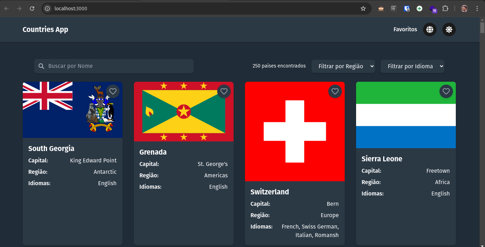
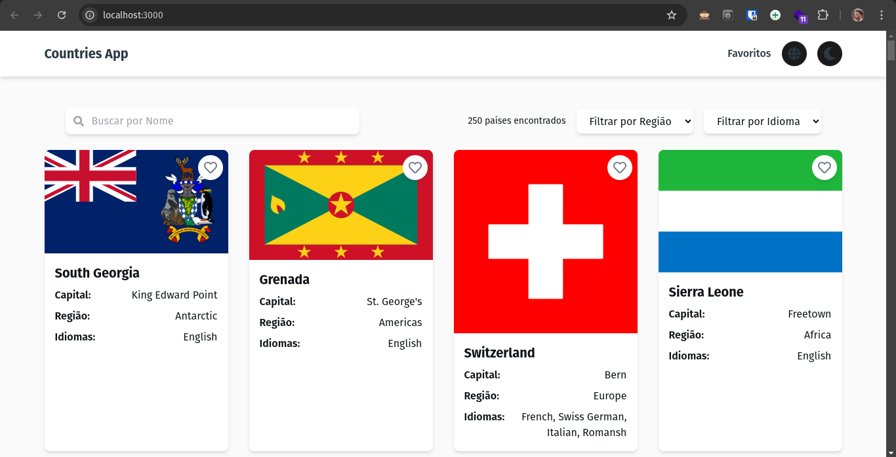
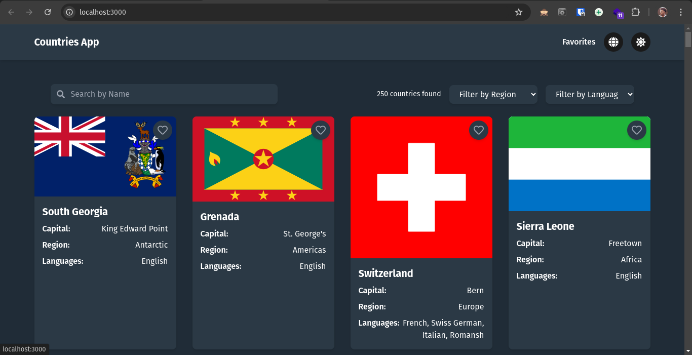
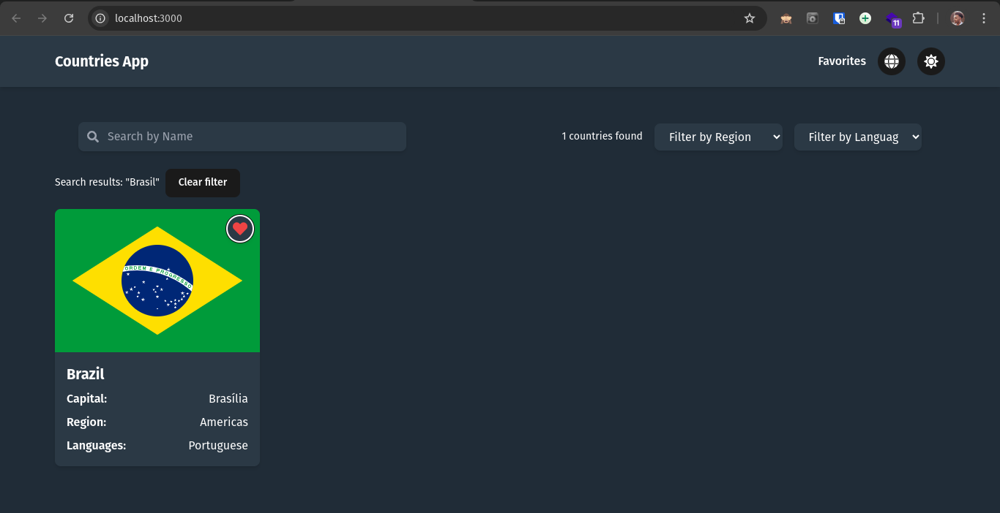
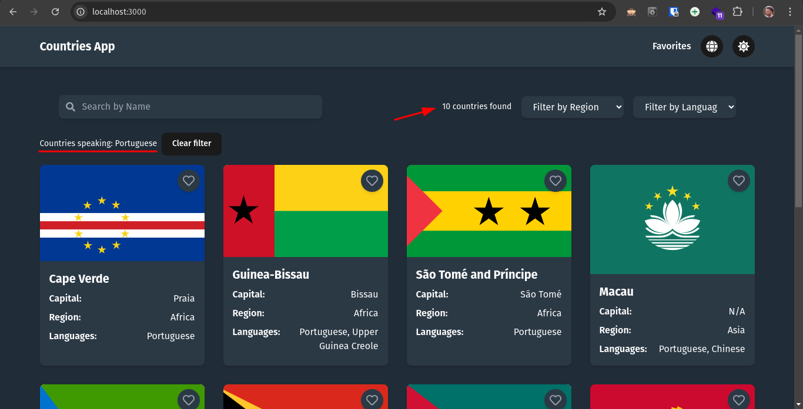
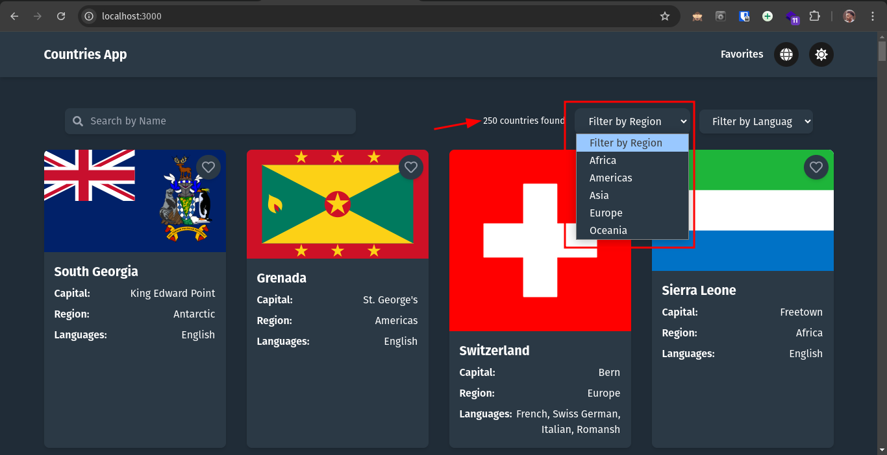
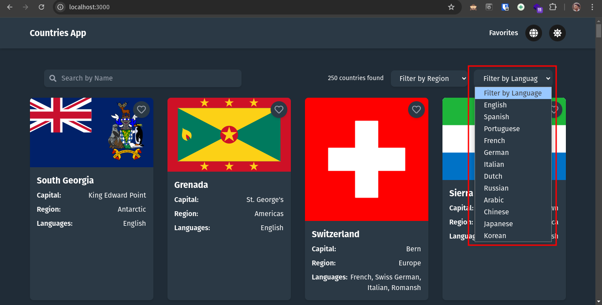
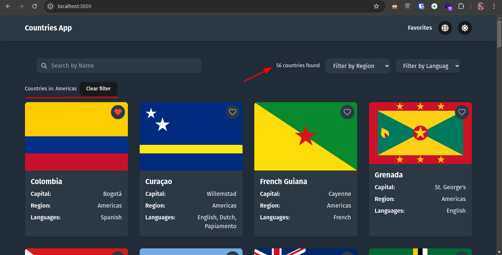
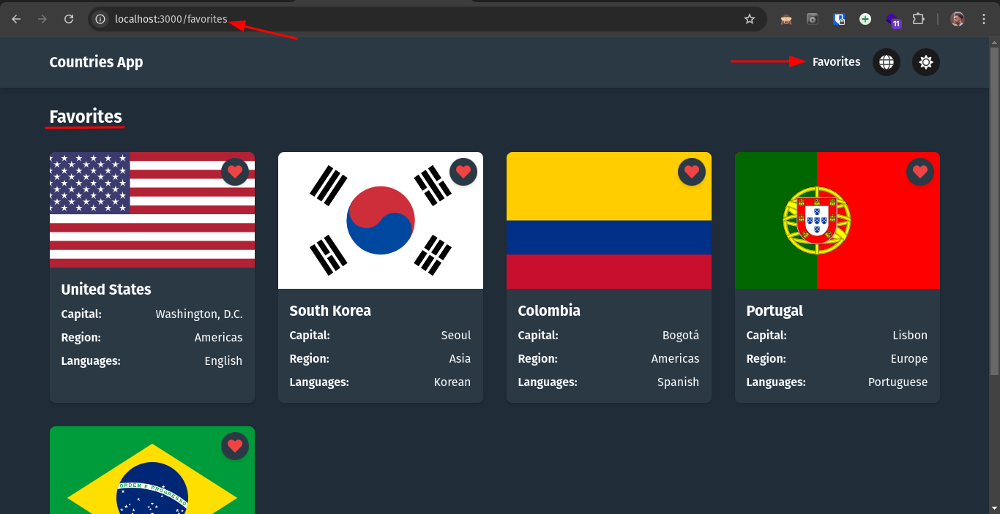
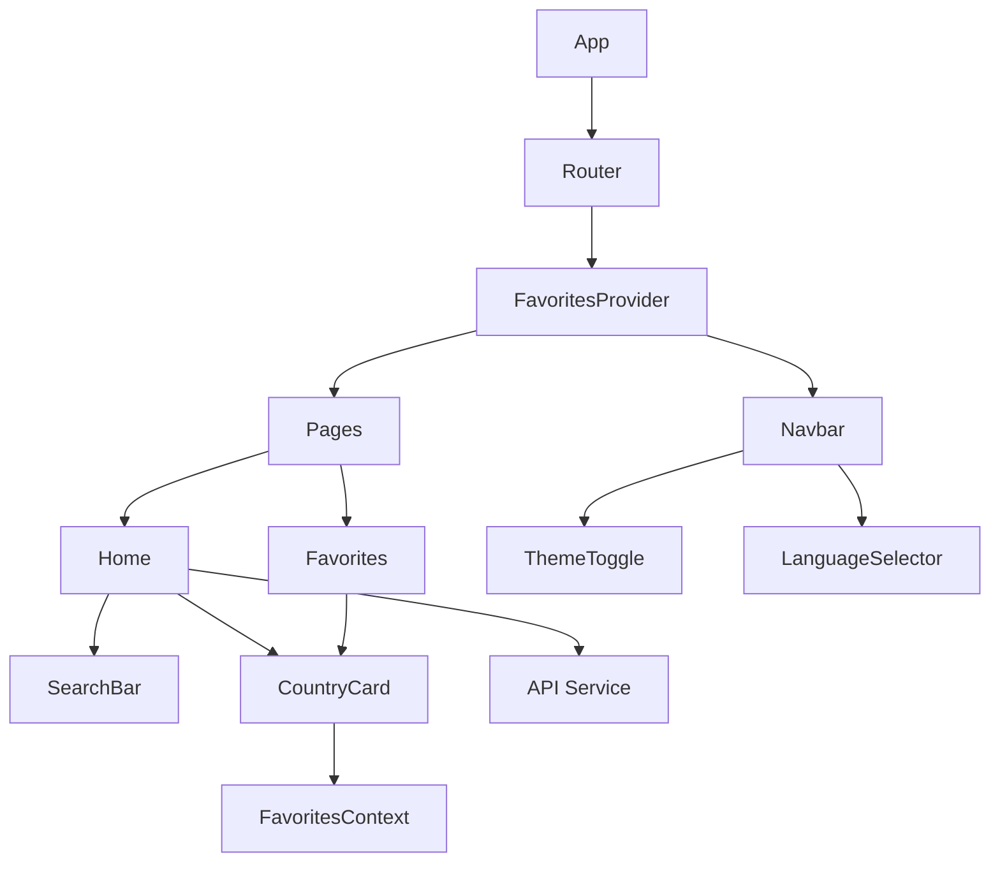

[🇧🇷️](README-PTBR.md)
# 🌎 Search Country App

A modern and responsive web application to explore country information, supporting multiple languages ​​and themes.

## 📋 Table of Contents

- [Overview](#-overview)
- [Features](#-features)
- [Technologies](#-technologies)
- [Architecture](#-architecture)
- [Installation](#-installation)
- [Project Structure](#-project-structure)
- [Components](#-components)
- [Contexts](#-contexts)
- [Services](#-services)
- [Internationalization](#-internationalization)
- [Themes](#-themes)
- [Performance](#-performance)
- [Contribution](#-contribution)
- [License](#-license)

## 🔭 Overview

Search Country is a web application that allows users to:
- Explore countries around the world
- Search countries by name
- Filter countries by region
- Save favorite countries
- Toggle between light and dark themes

## 🖼️ View 

<p align="center">
  <a href="assets/img/home.png"></a>
  <a href="assets/img/home-white.png"></a>
  <a href="assets/img/home-en.png"></a>
</p>

<p align="center">
  <a href="assets/img/search.png"></a>
  <a href="assets/img/region.png"></a>
  <a href="assets/img/filter.png"></a>
</p>

<p align="center">
  <a href="assets/img/language.png"></a>
  <a href="assets/img/filter.png"></a>
  <a href="assets/img/countries.png"></a>
</p>

<p align="center">
  <a href="./assets/img/favorites.png"></a>
</p>


## ⭐ Features

### Search and Filters
- 🔍 Real-time search by country name
- 🌍 Filter by region (Africa, Americas, Asia, Europe, Oceania)
- 💾 Favorites persistence in localStorage
- 🌓 Dark/light theme with persistence
- 🌐 Multiple language support (PT-BR/EN)

### Interface
- 📱 Responsive design for all devices
- 🎨 Light and dark themes
- ⚡ Smooth animations with Framer Motion
- 🎯 Accessibility with ARIA labels
- 🖼️ Lazy loading of images

## 🚀 Technologies

### Core
- **React 18** - Core library
- **Vite** - Build tool and dev server
- **React Router 6** - Routing
- **Context API** - State management

### Styling
- **Tailwind CSS** - Utility CSS framework
- **PostCSS** - CSS processor
- **Framer Motion** - Animation library

### Data and State
- **Axios** - HTTP client
- **localStorage** - Local persistence
- **i18next** - Internationalization

### Development
- **ESLint** - Linting
- **React Icons** - Icons
- **Headless UI** - Accessible components

## 🏗 Architecture



## 🛠️ Installation

1. Clone the repository:
```bash
git clone https://github.com/your-username/search-country.git
cd search-country
```

2. Install the dependencies:
```bash
npm install
```

3. Start the development server:
```bash
npm run dev
```

4. Build for production:
```bash
npm run build
```

## 📁 Project Structure

```
search-country/
├── public/
│ ├── locales/ # Translation files
│ └── vite.svg # Favicon
├── src/
│ ├── components/ # Reusable components
│ ├── context/ # React contexts
│ ├── pages/ # Application pages
│ ├── services/ # Services and APIs
│ └── ... # Configuration files
```

## 🧩 Components

### Navbar
- Main navigation
- Theme switcher
- Language selector
- Bookmark link

### SearchBar
- Search input
- Region selector
- Visual feedback
- Search debounce

### CountryCard
- Display country data
- Favorite button
- Lazy image loading
- Hover animations

## 💾 Contexts

### FavoritesContext
- Manage favorite countries
- Persistence in localStorage
- Add/remove methods
- Global favorite state

## 🌐 Services

### API
- Integration with Rest Countries API
- Error handling
- Request caching
- Response typing

## 🌍 Internationalization

- Support for PT-BR and EN
- Full translations
- Language persistence
- Fallback to EN

## 🎨 Themes

### Light
- Soft colors
- High contrast
- Subtle shadows

### Dark
- Dark colors
- Adequate contrast
- Blue light reduction

## ⚡ Performance

- Lazy image loading
- Code splitting per route
- Asset Minification
- API Caching
- Bundle Optimization

## 🤝 Contribution

1. Fork the project
2. Create your branch (`git checkout -b feature/AmazingFeature`)
3. Commit your changes (`git commit -m 'Add some AmazingFeature'`)
4. Push to the branch (`git push origin feature/AmazingFeature`)
5. Open a Pull Request

## 📝 License

This project is licensed under the MIT License. See the [LICENSE](LICENSE) file for more details.
